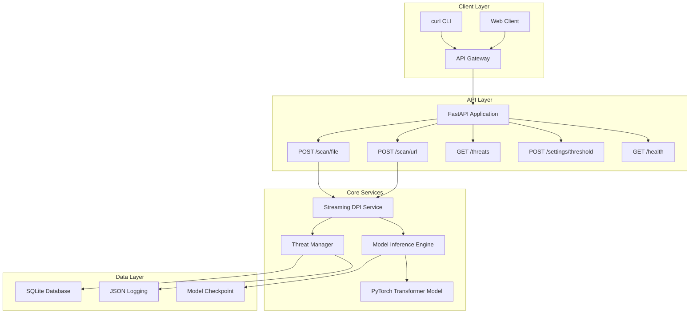
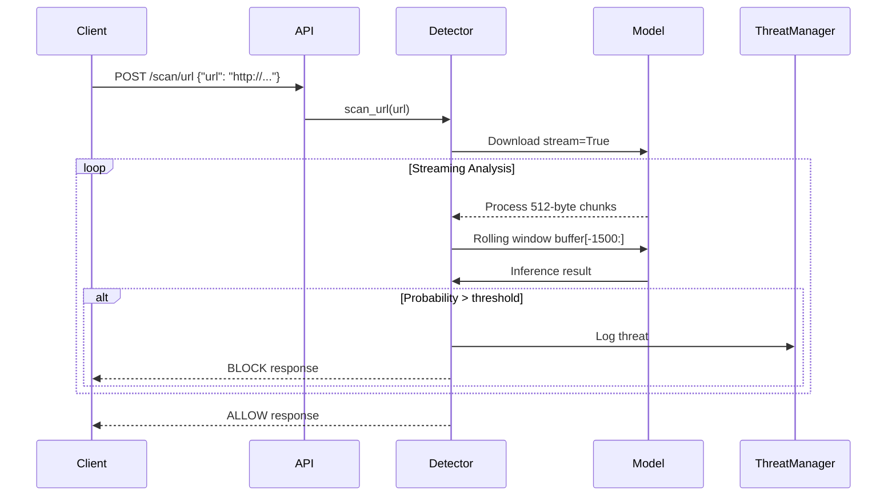

# Real-Time Malware Detection System - Architecture Plan

## Executive Summary

This document outlines the implementation plan for a production-grade malware detection system that inspects network traffic and files in real-time using Transformer models with streaming byte-level analysis.

## System Architecture

### High-Level Component Diagram



### Data Flow for URL Scanning



## Core Components

### 1. Settings Configuration (`settings.py`)

**Purpose:** Centralized configuration management using Pydantic BaseSettings

```python
class Settings(BaseSettings):
    # Detection thresholds
    confidence_threshold: float = 0.7
    low_risk_threshold: float = 0.3
    medium_risk_threshold: float = 0.5
    high_risk_threshold: float = 0.7
    critical_threshold: float = 0.9
    
    # Streaming settings
    chunk_size: int = 512
    window_size: int = 1500
    max_file_size: int = 100 * 1024 * 1024
    download_timeout: int = 30
    
    # Model settings
    model_path: str = "model/finetuned_best_model.pth"
    vocab_size: int = 259
    d_model: int = 768
    temperature: float = 1.0
    
    # Database
    database_url: str = "sqlite:///threats.db"
    
    # Server
    host: str = "0.0.0.0"
    port: int = 8000
```

### 2. Data Models (`models.py`)

**Purpose:** Pydantic v2 schemas for API requests/responses

```python
# Request Models
class URLScanRequest(BaseModel):
    url: HttpUrl
    block_on_detection: bool = True

class FileScanRequest(BaseModel):
    file: UploadFile

class ThresholdUpdateRequest(BaseModel):
    threshold: float = Field(ge=0.0, le=1.0)

# Response Models
class ScanResult(BaseModel):
    source: str
    source_type: str
    probability: float
    risk_level: RiskLevel
    bytes_scanned: int
    blocked: bool
    scan_time_ms: float
    details: Optional[dict] = None

class ThreatLog(BaseModel):
    id: int
    source: str
    source_type: str
    probability: float
    bytes_scanned: int
    risk_level: RiskLevel
    timestamp: datetime
    details: Optional[str]
    blocked: bool

class HealthStatus(BaseModel):
    status: str
    model_loaded: bool
    database_connected: bool
    memory_usage_mb: float
    uptime_seconds: float
```

### 3. Database Layer (`database.py`)

**Purpose:** SQLite operations for threat logging

```python
class ThreatDatabase:
    def init_database(self):
        # CREATE TABLE threats with indexes
        # Index on timestamp, risk_level, source
    
    def log_threat(self, source, source_type, probability, 
                   bytes_scanned, details=None):
        # Calculate risk level
        # Insert into SQLite
        # Return inserted ID
    
    def get_recent_threats(self, limit=100):
        # SELECT with ORDER BY timestamp DESC
        # Return list of dicts
    
    def get_threat_stats(self):
        # Aggregate query for statistics
```

### 4. Threat Manager (`threat_manager.py`)

**Purpose:** Risk assessment and threat classification

```python
RISK_LEVELS = {
    (0.0, 0.3): "BENIGN",
    (0.3, 0.5): "LOW",
    (0.5, 0.7): "MEDIUM",
    (0.7, 0.9): "HIGH",
    (0.9, 1.0): "CRITICAL"
}

class ThreatManager:
    def calculate_risk_level(self, probability: float) -> str:
        # Map probability to risk level
    
    def log_threat(self, source, source_type, probability, 
                   bytes_scanned, details=None):
        # Call database.log_threat()
        # Create structured log entry
```

### 5. Detector Engine (`detector.py`)

**Purpose:** Core streaming DPI and model inference

```python
class StreamingDetector:
    def scan_url(self, url: str):
        """Stream-download URL and detect malware mid-download"""
        with requests.get(url, stream=True) as r:
            buffer = bytearray()
            for chunk in r.iter_content(chunk_size=512):
                buffer.extend(chunk)
                buffer = buffer[-1500:]
                
                # Model inference
                probability = self.infer(buffer)
                
                # Early termination
                if probability > self.threshold:
                    return ThreatDetected(probability)
        
        return Safe
        
    def infer(self, bytes_data: bytes):
        """Run transformer model inference"""
        # Byte to token IDs (0-255 + special tokens)
        tokens = self.byte_to_token_ids(bytes_data)
        
        # Pad/truncate to 1500 tokens
        tokens = self.pad_or_truncate(tokens, 1500)
        
        # Inference
        tensor = torch.tensor([tokens], dtype=torch.long)
        with torch.no_grad():
            logits = model(tensor)
            scaled_logits = logits / temperature
            probability = torch.sigmoid(scaled_logits).item()
        
        return probability
```

### 6. FastAPI Application (`app.py`)

**Purpose:** API endpoints and request handling

```python
app = FastAPI(title="Malware Detection Gateway")

@app.post("/scan/url")
async def scan_url(request: URLScanRequest):
    """Stream-download URL and detect malware mid-download"""
    result = await asyncio.to_thread(detector.scan_url, str(request.url))
    return result

@app.post("/scan/file")
async def scan_file(file: UploadFile):
    """Upload file and analyze in streaming mode"""
    result = await asyncio.to_thread(detector.scan_file, file)
    return result

@app.get("/threats")
async def get_threats(limit: int = 100, offset: int = 0):
    """Return threat logs with pagination"""
    return database.get_recent_threats(limit, offset)

@app.post("/settings/threshold")
async def update_threshold(request: ThresholdUpdateRequest):
    """Change confidence threshold dynamically"""
    settings.confidence_threshold = request.threshold
    return {"status": "updated", "new_threshold": request.threshold}

@app.get("/health")
async def health_check():
    """System status with metrics"""
    return health_service.get_status()
```

## Project Structure

```
PacketInspectionTransformerV2/
├── app.py                          # FastAPI application & endpoints
├── detector.py                     # Core DPI & model inference logic
├── threat_manager.py               # Threat logging & risk assessment
├── database.py                     # SQLite database operations
├── models.py                       # Pydantic data models
├── settings.py                     # Configuration management
├── config/
│   ├── system_config.json          # Runtime configuration
│   └── model_config.py             # Model-specific settings
├── model/
│   └── finetuned_best_model.pth    # Pretrained transformer
├── requirements.txt                # Python dependencies
├── tests/
│   ├── test_api.py                 # API endpoint tests
│   ├── test_detector.py            # Detection logic tests
│   └── test_streaming.py           # Streaming tests
├── logs/                           # Structured logs
│   └── malware_alerts.log
└── README.md                       # Project documentation
```

## Risk Level Classification

| Probability Range | Risk Level | Action |
|-------------------|------------|--------|
| 0.0 - 0.3 | BENIGN | Allow |
| 0.3 - 0.5 | LOW | Log only |
| 0.5 - 0.7 | MEDIUM | Log & warn |
| 0.7 - 0.9 | HIGH | Log & alert |
| 0.9 - 1.0 | CRITICAL | Block & alert |

## API Usage Examples

```bash
# Scan a URL
curl -X POST "http://localhost:8000/scan/url" \
  -H "Content-Type: application/json" \
  -d '{"url": "http://example.com/file.exe"}'

# Upload a file
curl -X POST "http://localhost:8000/scan/file" \
  -H "Content-Type: multipart/form-data" \
  -F "file=@suspicious.exe"

# Get threat logs
curl "http://localhost:8000/threats?limit=50"

# Update threshold
curl -X POST "http://localhost:8000/settings/threshold" \
  -H "Content-Type: application/json" \
  -d '{"threshold": 0.8}'

# Health check
curl "http://localhost:8000/health"
```

## Success Criteria

- [ ] Real-time Processing: No batch scanning, streaming only
- [ ] Low Latency: <100ms detection time
- [ ] Early Termination: Stop processing when threat detected
- [ ] Memory Efficiency: No full-file loading
- [ ] Accurate Risk Classification: Proper mapping of probabilities to risk levels
- [ ] Complete Threat Logging: All detections logged to database
- [ ] Adversarial Robustness: Basic defenses against evasion attempts

## Implementation Order

1. **Foundation:** settings.py, models.py, requirements.txt
2. **Data Layer:** database.py, config files
3. **Core Logic:** threat_manager.py, detector.py
4. **API Layer:** app.py
5. **Testing:** All test files
6. **Documentation:** README.md
7. **Integration:** Full system test